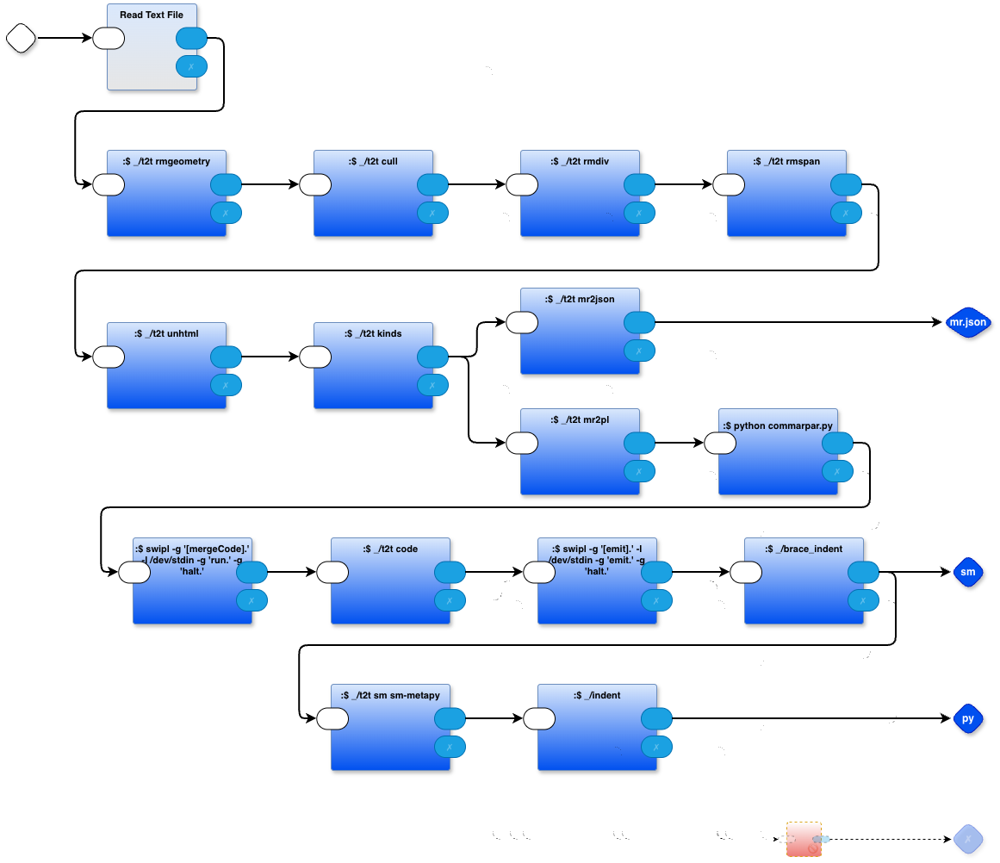
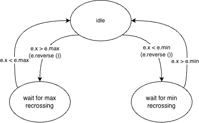
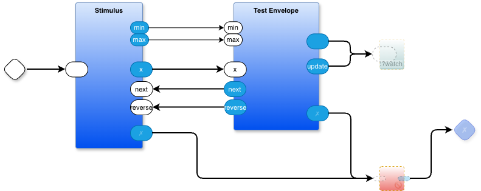
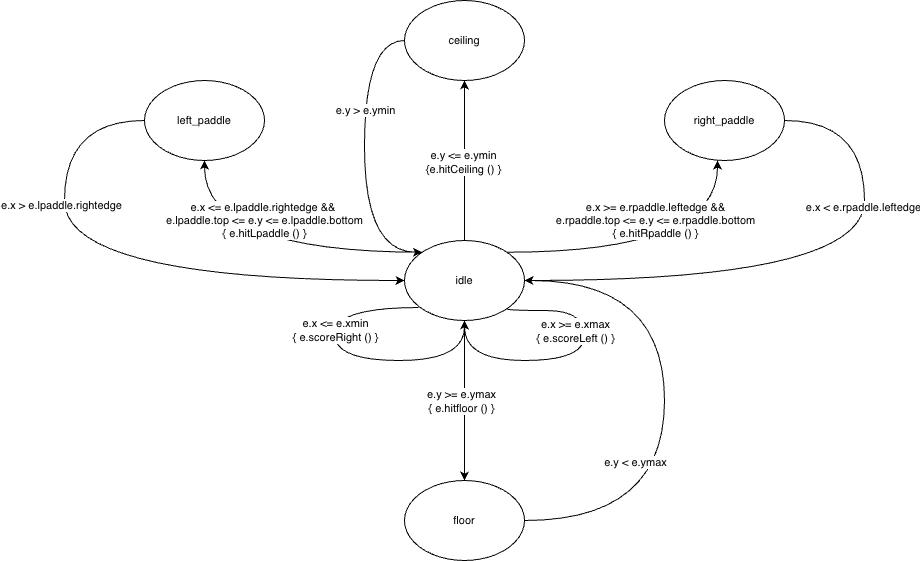

# Overview

1. Convert the DPL transmogrifier diagram `smdpl.drawio` to Python `smdpl.py`.  I've chopped the design up into many small pieces. If this were production code, we would want to optimize the code by refactoring the design to use fewer pieces, but this is not production code - it's a development tool.

2. Use `smdpl.py` to convert the state machine diagram `looper.drawio` to `looper.py`. 

3. Include (import) `looper.py` in the test jig and run the .

The test jig is in `testjig.drawio`. It creates a "stimulus-response" test of `looper.py`. The stimulus driver `stimulus.py`, the envelope that contains the looper is `testenvelope.py`. The response is observed using a probe named `watch`. If everything works OK, then the responses are displayed on the console in real time, whereas if an implementation error occurs, the error message is contained in the output `out.✗`.

To run the test jig, we use `testermain.py`. It installs the 2 parts - stimulus and testenvelope - and injects a kick-off mevent (empty string in this case) into the top level of the test jig.

Practically, step (1) needs to be performed only once. Once the transmogrifier (compiler) has been created, we don't need to keep re-creating it. I'm re-creating it every time, though, while bootstrapping. [Rebuilding it from scratch doesn't take long enough on modern hardware to justify a makefile-driven approach].

As it stands, `looper.py` is generated sa raw Python code meant to be copy/pasted or imported into another Python program. It is, at this point in time, not formatted for use in a PBP diagram. The job of `testenvelope.py` is to create the necessary scaffolding to use `looper.py` in a PBP diagram. 

# usage
`./@make`

# First-time usage
`./INSTALL.bash`
`./@make`

# install
`./INSTALL.bash`

# Future
- The smdpl transmogrifier should emit ready-to-run-in-PBP Python code, but, this would involve some design considerations that I don't want to think about yet, e.g. how to declare on the sm diagram the inputs that trigger transitions (e.g "x").

- At this moment, I'm just testing the looper code (diagram). When I'm happy with the tests, I will probably just copy it over and incorporate it into the Pong project.

# Further Reading
[Little Language Case Study - Generating Code for Simple State Machines https://programmingsimplicity.substack.com/p/little-language-case-study-generating?r=1egdky](https://programmingsimplicity.substack.com/p/little-language-case-study-generating?r=1egdky)
# Appendix - repository

# Appendix - [WIP] Use-Case in PBP-Pong Project
I'm using the state machine diagram transmogrifier in another project (pbp-pong). Below is an early attempt at figuring out the logic for the collision detector (warning: this design is preliminary and might contain significant errors)

