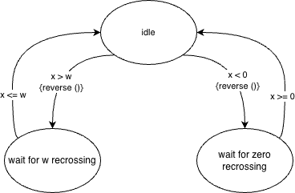

# Overview



Convert a diagram to `.sm` format.

```
state "idle" {
    {}
    {
        %next "wait for w recrossing" %when (x > w) {reverse ()}
        %next "wait for zero recrossing" %when (x < 0) {reverse ()}
        }
    {}
    }
state "wait for w recrossing" {
    {}
    {
        %next "idle" %when (x <= w)
        }
    {}
    }
state "wait for zero recrossing" {
    {}
    {
        %next "idle" %when (x >= 0)
        }
    {}
    }
```


Then, convert the `.sm` file to some programming language, e.g. Python.

```
class SM_looptest:
    
    def enter_idle (self):
        self.state = idle
        
    def step_idle (self):
        if (x > w):
            exit_idle ()
            reverse ()
            enter_wait_for_w_recrossing ()
        if (x < 0):
            exit_idle ()
            reverse ()
            enter_wait_for_zero_recrossing ()
    def exit_idle (self):
        pass
    def enter_wait_for_w_recrossing (self):
        self.state = wait_for_w_recrossing
        
    def step_wait_for_w_recrossing (self):
        if (x <= w):
            exit_wait_for_w_recrossing ()
            enter_idle ()
    def exit_wait_for_w_recrossing (self):
        pass
    def enter_wait_for_zero_recrossing (self):
        self.state = wait_for_zero_recrossing
        
    def step_wait_for_zero_recrossing (self):
        if (x >= 0):
            exit_wait_for_zero_recrossing ()
            enter_idle ()
    def exit_wait_for_zero_recrossing (self):
        pass
    def __init__ (self):
        self.enter_idle
    def step (self):
        {
            "idle": self.step_idle,
            "wait for w recrossing": self.step_wait_for_w_recrossing,
            "wait for zero recrossing": self.step_wait_for_zero_recrossing,
        } [self.state] ()
        
sm = SM_looptest ()
```


# usage
`./@make`

# install
`./INSTALL.bash`

